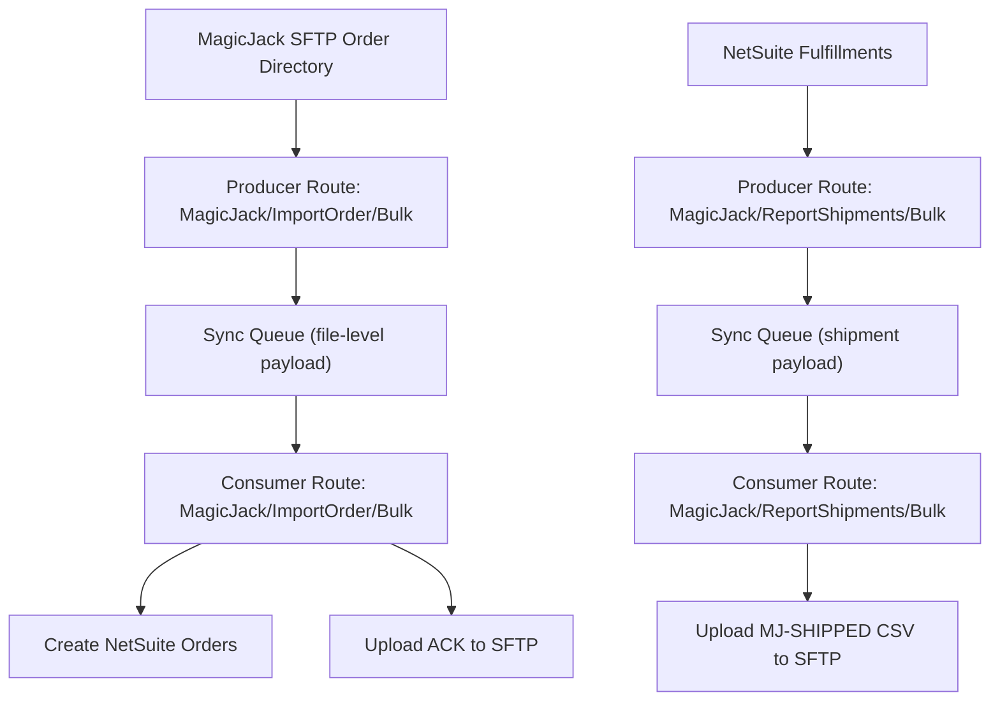

# MagicJack Integration (Framework-Strict)

## Goal

Implement MagicJack using the existing route-driven framework exactly as documented in [`docs/integration-framework.md`](/Users/nabeelaayub/code/Q1-Wireless/q1w_customizations/docs/integration-framework.md):
- **Producer** gathers source data and writes Sync Queue entries.
- **Consumer** processes queue entries and performs side effects.
- Reuse existing generic script entrypoints:
  - [`q1w_data_producer_sch.js`](/Users/nabeelaayub/code/Q1-Wireless/q1w_customizations/src/FileCabinet/SuiteScripts/quality_one_wireless/scheduledscript/q1w_data_producer_sch.js)
  - [`q1w_data_consumer_sch.js`](/Users/nabeelaayub/code/Q1-Wireless/q1w_customizations/src/FileCabinet/SuiteScripts/quality_one_wireless/scheduledscript/q1w_data_consumer_sch.js)

## Required Architecture

## Implementation Scope

### 1) Keep and use the generic producer/consumer entry scripts

- Ensure route registration happens before execution in:
  - [`q1w_data_producer_sch.js`](/Users/nabeelaayub/code/Q1-Wireless/q1w_customizations/src/FileCabinet/SuiteScripts/quality_one_wireless/scheduledscript/q1w_data_producer_sch.js)
  - [`q1w_data_consumer_sch.js`](/Users/nabeelaayub/code/Q1-Wireless/q1w_customizations/src/FileCabinet/SuiteScripts/quality_one_wireless/scheduledscript/q1w_data_consumer_sch.js)
- No dedicated MagicJack scheduled-script entry files are needed.

### 2) Route registration and callback wiring

- Update route registry in:
  - [`q1w_sync_routes.js`](/Users/nabeelaayub/code/Q1-Wireless/q1w_customizations/src/FileCabinet/SuiteScripts/quality_one_wireless/modules/managers/q1w_sync_routes.js)
- Register four route handlers:
  - `MagicJack/ImportOrder/Bulk` producer callback
  - `MagicJack/ImportOrder/Bulk` consumer callback
  - `MagicJack/ReportShipments/Bulk` producer callback
  - `MagicJack/ReportShipments/Bulk` consumer callback

### 3) Producer callbacks (enqueue only)

- **Order ingest producer**:
  - Connect to SFTP, list/download files.
  - Parse CSV (`|`) via PapaParse.
  - Build one queue payload per file: `{ sourceFileName, rows: [...] }`.
  - Queue action: `ImportOrderBulk`.
  - Move successfully enqueued files to `/processed`.
- **Shipment producer**:
  - Query eligible NetSuite fulfillments.
  - Build shipment payload rows.
  - Enqueue for outbound SFTP upload.
  - Queue action: `ReportShipmentsBulk`.

### 4) Consumer callbacks (side effects)

- **Order consumer**:
  - For each file-level queue entry, process all rows.
  - Apply fail-entire-file policy (Option A).
  - On full success, upload ACK file to SFTP.
- **Shipment consumer**:
  - Read queued shipment payload.
  - Build CSV and upload `MJ-SHIPPED_*.csv` to SFTP.
  - Upsert synced-record references for dedupe.

### 5) Shared modules and constants

- Keep/add reusable modules:
  - [`q1w_sftp_helper.js`](/Users/nabeelaayub/code/Q1-Wireless/q1w_customizations/src/FileCabinet/SuiteScripts/quality_one_wireless/modules/helper/q1w_sftp_helper.js)
  - [`q1w_magicjack_validator.js`](/Users/nabeelaayub/code/Q1-Wireless/q1w_customizations/src/FileCabinet/SuiteScripts/quality_one_wireless/modules/managers/q1w_magicjack_validator.js)
  - [`q1w_magicjack_transformer.js`](/Users/nabeelaayub/code/Q1-Wireless/q1w_customizations/src/FileCabinet/SuiteScripts/quality_one_wireless/modules/managers/q1w_magicjack_transformer.js)
  - [`q1w_magicjack_manager.js`](/Users/nabeelaayub/code/Q1-Wireless/q1w_customizations/src/FileCabinet/SuiteScripts/quality_one_wireless/modules/managers/q1w_magicjack_manager.js)
- Keep MAGICJACK constants in:
  - [`q1w_global_constants.js`](/Users/nabeelaayub/code/Q1-Wireless/q1w_customizations/src/FileCabinet/SuiteScripts/quality_one_wireless/constants/q1w_global_constants.js)

### 6) SDF object alignment

- Keep/modify only deployment XMLs required by framework usage:
  - Consumer deployment for MagicJack route in [`customscript_q1w_data_consumer_ss.xml`](/Users/nabeelaayub/code/Q1-Wireless/q1w_customizations/src/Objects/customscript_q1w_data_consumer_ss.xml)
  - Producer deployment in existing producer script XML as needed
- Remove/deprecate standalone MagicJack scheduled-script XMLs if present, because route-driven generic scripts own execution.

## Validation Checklist

- Route strings match feature config slugs exactly.
- `ImportOrderBulk` and `ReportShipmentsBulk` queue actions are used consistently between producer and consumer callbacks.
- File move to `/processed` occurs only after queue enqueue success.
- Order consumer enforces fail-entire-file and only uploads ACK on full success.
- Shipment flow dedupes by synced-record references.
- Lints pass on touched files.
