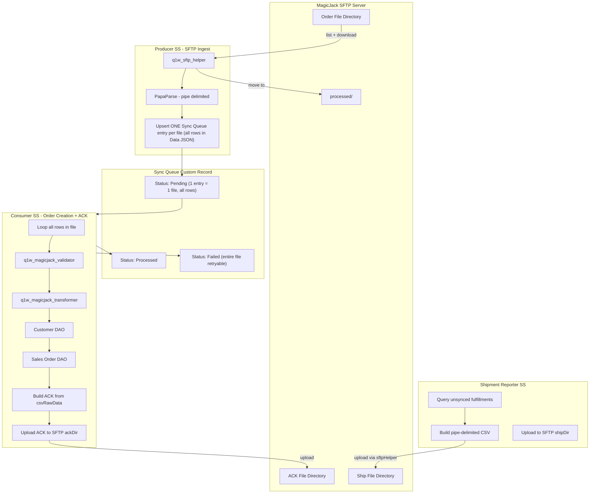

# MagicJack SFTP Integration via SuiteScript

## Architecture Overview

Leverage the existing **Producer/Consumer** framework (`q1w_producer.js` / `q1w_consumer.js`) and custom records (`Integration Config`, `Feature Config`, `Sync Queue`, `Synced Records Reference`, `Failed Records`) to build a generic SFTP integration layer, then wire MagicJack-specific transformation/validation on top.

**Key design: one Sync Queue entry per file.** The producer downloads a CSV file, parses all rows, and stores the entire file's rows as a JSON array in a single Sync Queue `Data` field. The consumer then processes all rows in one pass, creates orders, builds the ACK file, and uploads it -- all within a single queue entry's lifecycle. If any row fails, the entire file is marked Failed and can be retried as a unit.



## Record Configuration (Data Setup -- No Schema Changes)

All 3 flows use the **existing** custom record schema. No new custom records or fields needed.

### Integration Config Record

Create one record in NetSuite UI:
- **Name**: `MagicJack`
- **System**: `MagicJack`
- **Config JSON** (`custrecord_q1w_ic_configjson`):

```json
{
  "sftpHost": "<magicjack-sftp-host>",
  "sftpPort": 22,
  "sftpUsername": "<username>",
  "sftpKeyId": "custkey_q1w_magicjack",
  "sftpHostKey": "<base64-host-key>",
  "sftpHostKeyType": "rsa",
  "orderFileDirectory": "/orders",
  "ackFileDirectory": "/ack",
  "shipFileDirectory": "/shipments",
  "processedSubdir": "processed"
}
```

SSH key uploaded at **Setup > Company > Keys** using `N/keyControl`. The `sftpKeyId` is the script ID of that key record (e.g. `custkey_q1w_magicjack`).

**Alternate — username/password auth** (use `sftpPasswordGuid` from a credential field; do not use plaintext password in JSON):

```json
{
  "sftpHost": "<magicjack-sftp-host>",
  "sftpPort": 22,
  "sftpUsername": "<username>",
  "sftpPasswordGuid": "<guid-from-credential-field>",
  "sftpHostKey": "<base64-host-key>",
  "sftpHostKeyType": "rsa",
  "orderFileDirectory": "/orders",
  "ackFileDirectory": "/ack",
  "shipFileDirectory": "/shipments",
  "processedSubdir": "processed"
}
```

### Feature Config Records

Two Feature Config records, all linked to the MagicJack Integration Config. ACK upload is handled inline by the consumer (no separate feature needed).

| Name | Feature Slug (Route) | Go Live Date | Go Live Node | Go Live Date Format |
|---|---|---|---|---|
| MJ Import Orders | `MagicJack/ImportOrder/Bulk` | (set date) | `order_init_date` | `YYYYMMDD` |
| MJ Report Shipments | `MagicJack/ReportShipments/Bulk` | (set date) | `shippedDate` | `YYYYMMDD` |

---

## File Plan

### Constants Addition

**[constants/q1w_global_constants.js](src/FileCabinet/SuiteScripts/quality_one_wireless/constants/q1w_global_constants.js)** -- add `MAGICJACK` section:

```javascript
const MAGICJACK = {
  SYSTEM: 'MagicJack',
  CSV_DELIMITER: '|',
  CSV_COLUMNS: {
    ORDER_ID: 0, FNAME: 1, MIDDLE_NAME: 2, LNAME: 3,
    ADDR1: 4, ADDR2: 5, CITY: 6, STATE: 7, ZIP: 8, COUNTRY: 9,
    EXT_PROD_CODE: 10, SHIP_METHOD: 11, QUANTITY: 12,
    ORDER_INIT_DATE: 13, MEMBERID: 14, PIN: 15,
    SERVICE_ACTIVATION_DATE: 16, BILLING_TELEPHONE: 17,
    RMA_NUMBER: 18, RMA_DATE: 19, LOB: 20,
  },
  EXPECTED_COLUMN_COUNT: 21,
  QUEUE_ACTIONS: {
    IMPORT_ORDER: 'MagicJack/ImportOrderBulk',
    REPORT_SHIPMENTS: 'MagicJack/ReportShipmentsBulk',
  },
  RECORD_TYPES: {
    INBOUND_ORDER_FILE: 'MAGICJACK_INBOUND_ORDER_FILE',
    SHIPMENT: 'MAGICJACK_SHIPMENT',
  },
  COUNTRY_MAP: { CANADA: 'CA', UNITED_STATES: 'US', USA: 'US' },
  SHIPMENT_FILE_PREFIX: 'MJ-SHIPPED_',
};
```

### New Generic Module -- SFTP Helper

**`modules/helper/q1w_sftp_helper.js`** -- reusable for any future SFTP integration.

Responsibilities:
- `createConnection(configJson)` -- wraps `sftp.createConnection()` using `keyId` or `passwordGuid` (auto-detected), plus `url`, `username`, `hostKey`, `hostKeyType`, `port`, `directory` from config JSON
- `listFiles(connection, directory, sort)` -- wraps `connection.list()`, filters to files only (`directory === false`)
- `downloadFile(connection, filename, directory)` -- wraps `connection.download()`, returns `file.File`
- `uploadFile(connection, fileObj, filename, directory, replaceExisting)` -- wraps `connection.upload()`
- `moveFile(connection, from, to)` -- wraps `connection.move()`
- `createCsvFile(filename, content)` -- uses `N/file` to create an in-memory CSV `file.File` for upload

Each method wraps the N/sftp call with try-catch, structured error logging, and returns a consistent result object. This module is **not** MagicJack-specific -- any SFTP integration reuses it.

### New MagicJack Modules

**`modules/managers/q1w_magicjack_validator.js`** -- validates inbound CSV rows:
- `validateRow(csvRow)` -- checks array length === 21, required fields present (`order_id`, `memberid`, `addr1`, `city`, `state`, `zip`, `country`, `ext_prod_code`)
- Returns `{ isValid, errors[], validatedData }` where `validatedData` is the named-field object

**`modules/managers/q1w_magicjack_transformer.js`** -- transforms validated data to NS record payloads:
- `transformToCustomer(validatedData)` -- maps `fname`, `lname`, `memberid` (email), address fields to NS customer body/address
- `transformToSalesOrder(validatedData, customerId)` -- maps order fields to NS SO body + item line (uses Lookup Table for `ext_prod_code` -> NS item, `ship_method` -> NS ship method)
- `buildAckRow(originalCsvRawData)` -- prepends `'ACK'` to original pipe-delimited row
- `buildShipmentRow(fulfillmentData)` -- builds 26-column pipe-delimited shipment row per contract in handoff

**`modules/managers/q1w_magicjack_manager.js`** -- orchestrates per-file order creation + ACK:
- `processFile(parsedEntry, currentConfig, currentFeatureConfig)` -- the consumer callback. Each `parsedEntry.data` contains ALL rows for one CSV file:
  1. Parse JSON data from Sync Queue entry -- `{ sourceFileName, rows: [{ csvRawData, orderId }, ...] }`
  2. Loop through each row:
     a. Validate via `q1w_magicjack_validator` (column count, required fields)
     b. Find or create customer via `q1w_customer_dao` (lookup by email/`memberid`)
     c. Resolve item via Lookup Table (`ext_prod_code` -> NS item internal ID)
     d. Transform via `q1w_magicjack_transformer`
     e. Create/update Sales Order via `q1w_salesorder_dao`
     f. Collect created SO ID for Synced Records Reference
  3. **Fail-entire-file strategy**: if ANY row fails (validation, customer, item lookup, or SO creation), the entire file is marked Failed. No ACK is generated. The queue entry stays Failed with error details for all failing rows. On retry, all rows are reprocessed.
  4. On success (all rows processed): build ACK content by prepending `'ACK'` to each row's `csvRawData`, upload ACK file to SFTP `ackFileDirectory`
  5. Return `{ status: true, upsertId: sourceFileName, isReScheduleNeeded: false, getMoreRecords: false }`

### Scheduled Scripts

**1. `scheduledscript/q1w_magicjack_sftp_producer_ss.js`** -- Inbound Order Ingestion

Entry point: `execute()`. Uses `Producer.produceRecords()` with a callback that:
1. Loads Integration Config's `configJson` for SFTP credentials
2. Calls `SftpHelper.createConnection(configJson)`
3. Calls `SftpHelper.listFiles(conn, configJson.orderFileDirectory)`
4. For each file:
   a. `SftpHelper.downloadFile()` -> get file contents
   b. `Papa.parse(content, { delimiter: '|' })` -> array of row arrays
   c. Build a single data object: `{ sourceFileName, rows: [{ csvRawData: [...], orderId: row[0] }, ...] }`
   d. This becomes ONE item in the producer's `data` return array
5. Returns `{ data: [fileObj1, fileObj2, ...], isRescheduleNeeded: false, getMoreRecords: hasMoreFiles, alwaysUpsert: true }`
6. After each file is enqueued, calls `SftpHelper.moveFile()` to move file to `processed/` subdirectory

The `recordId` for each Sync Queue entry = **filename** (the idempotency key -- one queue entry per file, not per row).

The Sync Queue `Data` field (CLOBTEXT, ~1MB limit) holds the full JSON with all rows. A typical order row is ~200-300 chars; a file with 1,000 orders produces ~300KB of JSON -- well within limits.

**2. Consumer route registration** -- no new scheduled script needed

Register MagicJack consumer route in **[modules/managers/q1w_sync_routes.js](src/FileCabinet/SuiteScripts/quality_one_wireless/modules/managers/q1w_sync_routes.js)** (or a new route registration module):

```javascript
Router.routeProcess(
  'MagicJack/ImportOrder/Bulk',
  (config) => Consumer.consumeRecords(
    MagicJackManager.processFile,
    () => ({})
  )
);
```

The existing `q1w_data_consumer_sch.js` handles execution -- just needs a deployment with route = `MagicJack/ImportOrder/Bulk` and the MagicJack config ID.

The consumer calls `MagicJackManager.processFile` for each Sync Queue entry (= one file). The manager loops all rows internally, creates orders, builds ACK, uploads ACK to SFTP -- all in one pass. On any row failure, the entire file is marked Failed. No separate ACK script is needed.

**3. `scheduledscript/q1w_magicjack_shipment_ss.js`** -- Shipment Reporter

Logic:
1. Query item fulfillments that are linked to MagicJack sales orders (via `Synced Records Reference`) and have NOT yet been reported (no shipment reference record exists)
2. For each fulfillment: extract shipping address, tracking, item SKU, serial numbers (ICCID/IMEI), dates
3. Build 26-column pipe-delimited rows per the shipment contract in the handoff
4. Create file named `MJ-SHIPPED_{yyyyMMdd_HHmmss}.csv`
5. `SftpHelper.uploadFile()` to `shipFileDirectory`
6. Create `Synced Records Reference` entries for each reported fulfillment (prevents re-reporting)

### Script Deployment Records (SDF XML)

New SDF objects in `src/Objects/`:
- `customscript_q1w_magicjack_sftp_producer_ss.xml` -- with script params for route path + config ID
- `customscript_q1w_magicjack_shipment_ss.xml` -- with script param for config ID
- Add a new deployment to existing `customscript_q1w_data_consumer_ss.xml` for MagicJack consumer route (route = `MagicJack/ImportOrder/Bulk`, config = MagicJack integration config ID)

### Lookup Table Data

Populate `Q1W Lookup Table` records for MagicJack:
- **Map Type**: `item_sku` -- Key: MagicJack `ext_prod_code` values, Value: NS item internal IDs
- **Map Type**: `ship_method` -- Key: MagicJack `ship_method` values, Value: NS ship method internal IDs
- **Map Type**: `country` -- Key: `CANADA`, Value: `CA` (etc.)

This keeps all mapping data-driven and editable without code changes.

---

## Key Design Decisions

**Why one Sync Queue entry per file (not per row)?**
Matches the Interchange pattern where the cache daemon wrote all rows for a file, then the process daemon consumed them as a unit. Storing all rows in one queue entry means: (a) the consumer has the full file context to build the ACK, (b) no need for a separate ACK script or "are all rows done?" grouping logic, (c) fewer queue records and less governance spent on queue operations, (d) atomic retry -- the entire file succeeds or fails as a unit.

**Why fail-entire-file (Option A)?**
If a single row fails (bad SKU, missing customer data, validation error), the entire file is marked Failed. No partial ACK is sent. This ensures MagicJack never receives an ACK for a file that was only partially processed. On retry, the file is reprocessed from scratch. Individual row errors are logged to Failed Records for debugging, but the queue entry status reflects the file as a whole.

**Why producer/consumer for inbound (not a direct Map/Reduce)?**
The existing framework provides governance management, rescheduling, error tracking via Failed Records, idempotency via Sync Queue, and audit trail via Synced Records Reference. A raw Map/Reduce would bypass all of this.

**Why ACK is inline in the consumer (not a separate script)?**
Since one queue entry = one file, the consumer callback already has all rows in memory when processing. After all orders are successfully created, building the ACK (prepend `ACK` to each original `csvRawData`) and uploading it is a simple post-loop step within the same callback. No timing, grouping, or inter-script coordination needed.

**Why generic SFTP helper (not MagicJack-specific)?**
If future SFTP integrations arise, they only need a new manager/transformer -- the connection, file operations, and CSV generation are reusable. The SFTP credentials live in Integration Config's `configJson`, so adding a new partner is just a new config record + partner-specific modules.

**CLOBTEXT size for per-file data**: The `custrecord_q1w_sync_q_data` field is CLOBTEXT (~1MB). A typical MagicJack order row is ~200-300 chars (21 pipe-delimited fields). A file with 1,000 orders produces ~300KB of JSON -- well within limits.

**N/sftp governance**: `download` = 100 units, `upload` = 100 units, `list` = 10 units, `move` = 10 units. A single scheduled script has 10,000 units. Processing ~45 files per execution is safe. The producer's `isReScheduleNeeded` check handles governance limits gracefully.
