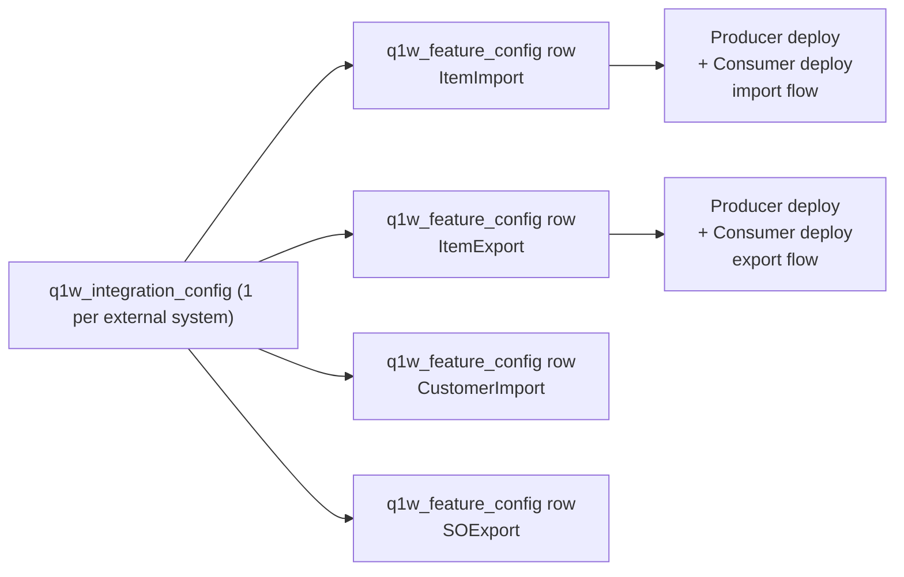

# Configuring Imports vs Exports (Q1W Integration Framework)

There is no explicit **direction** flag in the framework. Import vs export is a convention baked into three places: the **feature slug**, the **callbacks you write**, and the **`flow` argument** when you look up references. Everything else (config, queue, dashboard) is direction-agnostic.

## The configuration model



You get **one** `customrecord_q1w_integration_config` row per external system (it carries endpoint, username, password, system slug). Then you create **one `customrecord_q1w_feature_config` row per direction per entity** that all FK back to that same integration config. The same external system can sync items inbound AND outbound by having two feature rows: `ItemImport` and `ItemExport`.

## What configuration actually differs

| Configuration surface | Import | Export | Where it lives |
|---|---|---|---|
| Feature slug (`custrecord_q1w_fc_feature_route_slug`) | e.g. `ItemImport` | e.g. `ItemExport` | feature_config record |
| Route slug used by deployments | `MyERP/ItemImport/Bulk/7` | `MyERP/ItemExport/Bulk/7` | `custscript_q1w_producer_route_path` on the SS deployment |
| Producer callback | Calls external API, returns its rows | Runs NS search, returns NS rows | Your `Router.routeProcess(routeSlug, () => ProducerLib.produceRecords(cb, ...))` |
| Consumer callback | Calls `record.create/load` to write into NS, returns NS id as `upsertId` | Calls `https.post` to external API, returns external id as `upsertId` | Your `Router.routeProcess(routeSlug, () => ConsumerLib.consumeRecords(cb, ...))` |
| Reference lookup direction | `Integration.getRecordReference({ esRecordId, flow: 'IMPORT' })` returns NS id | `Integration.getRecordReference({ nsRecordId, flow: 'EXPORT' })` returns external id | `modules/dao/q1w_records_reference_dao.js` |
| Go-live filter | Applied by consumer against payload's `golive_date_node` | Same filter still runs; for exports the date node usually points to NS `lastmodifieddate` | feature_config record (`custrecord_q1w_fc_golive_node`, `custrecord_q1w_fc_golive_dateformat`) |

Everything else — the queue record type, failed-records record, lookup table, admin dashboard suitelet, router, producer-consumer plumbing — is identical for both directions.

## Route slug format

`Router.executeByRoute` parses the script-param string `route` into `${systemType}/${feature}/${execMode}/${configId}` (see `modules/managers/q1w_router.js`, `getDetailsFromRoute`).

For an export feature like **ItemExport** against system **MyERP** with config id **7**:

- Bulk: `MyERP/ItemExport/Bulk/7`
- Selective (on-demand): `MyERP/ItemExport/Selective/7`

Import features use the same shape with an `Import` feature name, e.g. `MyERP/ItemImport/Bulk/7`.

## The role of `Operation` and `flow`

Two places in the code expose the import/export concept as data:

### `Operation` constant (sync queue DAO)

`Operation = { IMPORT: 'IMPORT', EXPORT: 'EXPORT' }` in `modules/dao/q1w_sync_queue_dao.js`. Exported as a constant but **never auto-populated** on queue rows. You can use it in your own filters if you want.

### `flow` on reference lookup (the only API that changes behavior)

`flow: 'IMPORT' | 'EXPORT'` on `Integration.getRecordReference(...)`. This decides whether the NS id is the `recordId` column or the `upsertId` column in `customrecord_q1w_synced_record_reference`:

```71:90:src/FileCabinet/SuiteScripts/quality_one_wireless/modules/dao/q1w_records_reference_dao.js
  if (nsRecId) {
    if (flow === 'IMPORT') {
      filters.push('AND');
      filters.push([FIELDS.upsertId, 'is', nsRecId]);
      fieldToReturn = 'recordId';
    } else if (flow === 'EXPORT') {
      filters.push('AND');
      filters.push([FIELDS.recordId, 'is', nsRecId]);
      fieldToReturn = 'upsertId';
    }
  } else if (esRecId) {
    if (flow === 'IMPORT') {
      filters.push('AND');
      filters.push([FIELDS.recordId, 'is', esRecId]);
      fieldToReturn = 'upsertId';
    } else if (flow === 'EXPORT') {
      filters.push('AND');
      filters.push([FIELDS.upsertId, 'is', esRecId]);
      fieldToReturn = 'recordId';
    }
  }
```

**Mental model for the reference table:** `recordId` always holds the **source-system id**, `upsertId` always holds the **target-system id**.

- **Import:** source = external system, target = NetSuite
- **Export:** source = NetSuite, target = external system

Your consumer callback returns its `upsertId` and the framework writes the row. Direction is implied by which side wrote it; the `flow` argument tells the reader how to interpret it later.

## Concrete setup checklist for a new direction

To stand up one direction (example: **export inventory items to MyERP**):

1. **Pick a route slug** — `MyERP/ItemExport/Bulk/<configId>` and `.../Selective/<configId>` if you want on-demand from the dashboard.
2. **Create the feature_config row** in the NetSuite UI with:
   - `custrecord_q1w_fc_feature_route_slug` = `ItemExport`
   - `custrecord_q1w_fc_config` → your integration_config row
   - `custrecord_q1w_fc_golivedate` / `golive_node` / `golive_dateformat` = filter so old NS items do not get re-exported
3. **Write the two callbacks** — one for the producer (NS search → array of `{ recordId, ...payload }`), one for the consumer (HTTP POST → returns `{ status, upsertId }`).
4. **Write two scheduled-script entrypoints** that register routes via `Router.routeProcess(...)` and call `Router.executeByRoute(...)` — model after the UMS pattern in:
   - `ns-emirates-properties-integrations/ums/.../f3_ums_data_producer_sch.js`
   - `ns-emirates-properties-integrations/ums/.../f3_ums_data_consumer_sch.js`
5. **Author two `customscript_q1w_*_ss.xml` objects** in `src/Objects/`. Each XML defines one deployment whose script params (`custscript_q1w_producer_route_path`, `custscript_q1w_producer_config_id`) hard-code `MyERP/ItemExport/Bulk` plus the config id. Set schedule cadence in the deployment XML.

Repeat the whole list for `ItemImport` if you also want imports of the same entity — a parallel set of artifacts that reads/writes the same queue and reference tables.

## Reuse vs duplicate

| Asset | Reused across directions? |
|---|---|
| `customrecord_q1w_integration_config` row | Yes (one per external system) |
| `customrecord_q1w_feature_config` row | No — one per direction per entity |
| Producer SS file | Usually one file per integration, registers multiple route slugs (UMS registers both imports and exports in the same file) |
| Consumer SS file | Same as above |
| `customscript_q1w_*` XML + deployment | One deployment per (direction, exec mode), e.g. `ItemImportBulk`, `ItemExportBulk`, `ItemImportSelective`, `ItemExportSelective` — selective often shares a single producer/consumer deployment driven by `custscript_q1w_prdcr_is_selective = T` |
| Sync queue rows | Same table, distinguished by `custrecord_q1w_sync_q_action` value (`ItemImportBulk` vs `ItemExportBulk`) |
| Reference table rows | Same table; both directions write to it; `flow` disambiguates on read |
| Lookup table rows | Shared — same `(maptype, key)` row can be referenced by both directions |

## Summary

The framework treats import and export as the **same shape of pipeline**. You configure direction by:

1. Spinning up a separate **feature_config** row
2. Using a **route slug** whose feature segment says `Import` or `Export`
3. Writing **callbacks** that read/write the appropriate side

The only place the framework "knows" about direction at runtime is **`getRecordReference({ flow })`**.