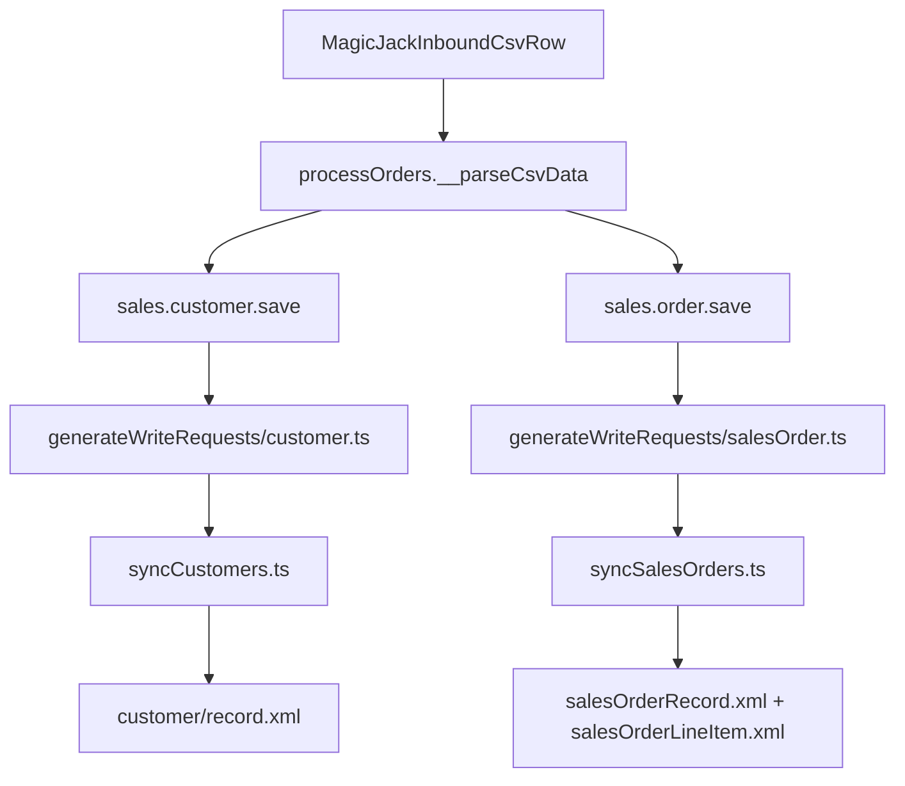

# MagicJack CSV to NetSuite Field Mapping

This document traces each MagicJack inbound CSV column through `processOrders.ts`, through Interchange NetSuite write-request generation/sync, into the **final NetSuite upsert XML** templates.

Use this as a prompt input when implementing MagicJack order creation directly in NetSuite SuiteScript.

## Data flow



Source files:
- MagicJack parsing: `src/modules/layer05/dataProcessing/magicJack/processOrders.ts`
- Write-request generation: `src/modules/layer06/daemons/netSuite/generateWriteRequests/customer.ts`, `salesOrder.ts`
- Sync/upsert: `src/modules/layer06/daemons/netSuite/syncCustomers.ts`, `syncSalesOrders.ts`
- XML assembly: `src/modules/layer02/dataSources/netSuite/salesOrder.ts`, `xml/customer/record.ts`
- Final XML templates:
  - `src/modules/layer02/dataSources/netSuite/xml/customer/record.xml`
  - `src/modules/layer02/dataSources/netSuite/xml/salesOrder/salesOrderRecord.xml`
  - `src/modules/layer02/dataSources/netSuite/xml/salesOrder/salesOrderLineItem.xml`

## Important migration note

MagicJack orders are **not included** in `sales.orders_eligible_to_write_to_erp_view` today, so Interchange's automated `netSuite_generateRequests` / `netSuite_syncSalesOrders` pipeline will not pick up MagicJack orders unless eligibility is changed or orders are force-generated by ID.

When moving to SuiteScript inside NetSuite, create Customer + Sales Order directly and treat the mappings below as the target NetSuite payload shape.

---

## Per-column CSV mapping (Interchange layer)

Legend:
- **Interchange Customer** = `sales.customer`
- **Interchange Sales Order** = `sales.order`, `sales.line_item`, `sales.product`

| Index | MagicJack field | Required | Interchange Customer | Interchange Sales Order | Notes |
| --- | --- | --- | --- | --- | --- |
| 0 | `order_id` | Yes | — | `order_number` via `makeOrderNumber(store.orderPrefix, order_id)`; `line_item.line_reference`; `data_cache.external_order.external_id` | Prefixed order number example: `MJ_12345`. |
| 1 | `fname` | No | `first_name` | shipping/billing `addressee` = `"{fname} {lname}"` | |
| 2 | `middle_name` | No | — | — | Parsed, unused. |
| 3 | `lname` | No | `last_name` | same addressee logic | |
| 4 | `addr1` | Yes | — | shipping/billing `street1` | Billing = shipping for MagicJack. |
| 5 | `addr2` | No | — | shipping/billing `street2` | |
| 6 | `city` | Yes | — | shipping/billing `city` | |
| 7 | `state` | Yes | — | shipping/billing `usState` | |
| 8 | `zip` | Yes | — | shipping/billing `postalCode` | |
| 9 | `country` | Yes | — | shipping/billing `countryCode`; `CANADA` -> `CA` | |
| 10 | `ext_prod_code` | Yes | — | product `sku`/`name`; line item product link | Must resolve to NetSuite inventory item. |
| 11 | `ship_method` | No | — | `requested_shipping_service` | Mapped via `net_suite.shipping_service`. |
| 12 | `quantity` | No | — | `line_item.quantity` (default `1`) | |
| 13 | `order_init_date` | No | — | `order_date` (`yyyyMMdd`) or `now()` | |
| 14 | `memberid` | Yes | `email` (customer key) | — | Treated as email. |
| 15 | `pin` | No | — | — | Parsed, unused. |
| 16 | `service_activation_date` | No | — | — | Parsed, unused. |
| 17 | `billing_telephone` | No | `phone_number` | shipping/billing `phone` | |
| 18 | `rma_number` | No | — | — | Parsed, unused. |
| 19 | `rma_date` | No | — | — | Parsed, unused. |
| 20 | `lob` | No | — | — | Parsed, unused. |

Hardcoded in `processOrders.ts` (not from CSV):
- `statusName = processing`
- `rawPaymentMethod = notProvided`
- `paymentMethodName = unknown`
- `chargeLines = []`
- all line money fields = `0`
- `shippingAddress.street3 = ''`, `company = ''`

---

## Derived values for MagicJack (typical 3PL store)

These are computed in NetSuite write-request code from store config + sales channel, not from CSV.

Assumption: MagicJack store uses `sales_channel_name = thirdPartyLogistics` (typical for SFTP/3PL stores).

| Write-request field | Source | Typical MagicJack value | Written to final SO XML? |
| --- | --- | --- | --- |
| `salesChannelInternalId` / `channelInternalId` | `externalDataUtil.salesChannel2ChannelInternalId[salesChannelName]` | `'1'` (prod) | Yes -> `<sales:class internalId="1" />` |
| `termsInternalId` | `externalDataUtil.salesChannel2PaymentTermsInternalId[salesChannelName]` | `'2'` (Net 30) | **No** — `<sales:terms>` is commented out in `salesOrderRecord.xml` |
| `customFormInternalId` | `config.netSuite.soCustomFormId` | environment-specific internal ID | Yes -> `<sales:customForm internalId="..." />` |
| `salesOrderStatus` | `salesChannelName === 'ecommerce' ? '_pendingApproval' : '_pendingFulfillment'` | `_pendingFulfillment` | Yes -> `<sales:orderStatus>` |
| `writePaymentMethod` | `salesChannelName === 'ecommerce'` | `false` | Controls whether payment method is emitted |
| `paymentMethodInternalId` | mapped from `raw_payment_method = notProvided` | mapped ID exists in DB, but... | **No for 3PL** — `syncSalesOrders` sets this to `null` when `writePaymentMethod=false`, so `<sales:paymentMethod>` is omitted |
| `shippingTotalCents` | order shipping total, zeroed for 3PL | `0` | Yes -> `<sales:shippingCost>0.00</sales:shippingCost>` |
| `pricePerUnitCents` (line) | item total + fee / qty for ecommerce; `0` for 3PL | `0` | Yes -> line `<sales:rate>0.00</sales:rate>` |
| `priceLevelInternalId` (line) | hardcoded in generator | `-1` (custom price level) | Yes -> `<sales:price internalId="-1" />` |
| `isTaxable` (header) | `ava_tax_total_cents > 0 OR tax_total_cents > 0` | `false` for zero-dollar MagicJack orders | Yes -> `<sales:isTaxable>false</sales:isTaxable>` |
| `isTaxable` (line) | same tax rule per line | `false` | Yes -> line `<sales:isTaxable>false</sales:isTaxable>` |
| `memo` | `orderNumber` unless affirm/amazon special cases | prefixed order number | Yes -> `<sales:memo>` |
| `otherRefNum` | `faireOrderId || orderNumber` | prefixed order number | Yes -> `<sales:otherRefNum>` |
| `faireOrderId` | DB column | empty for MagicJack | N/A |

Store-config fields (required):
- `subsidiaryInternalId` -> `<sales:subsidiary>`
- `departmentInternalId` -> `<sales:department>`
- `locationInternalId` -> `<sales:location>`
- `taxItemInternalId` -> `<sales:taxItem>`
- `brandInternalId` -> custom field `custbody_brand_transaction`
- `shipItemInternalId` -> `<sales:shipMethod>` (from CSV `ship_method` mapping)
- `salesRepInternalId` -> `<sales:salesRep>` (may be blank)
- `packingSlipPassThru` -> `custbody_packing_slip_passthru`
- `inventoryItemInternalId` -> line `<sales:item>` (from SKU = `ext_prod_code`)
- `customerInternalId` -> `<sales:entity>`

Third-party billing (`custbody_tpb_*`) fields come from `net_suite.third_party_account` via shipping-service mapping. MagicJack path usually leaves these blank unless configured.

---

## Final NetSuite Sales Order XML (`salesOrderRecord.xml`)

Template: `src/modules/layer02/dataSources/netSuite/xml/salesOrder/salesOrderRecord.xml`

This is the **actual upsert payload** built by `genSalesOrderRecord()` in `src/modules/layer02/dataSources/netSuite/salesOrder.ts`.

| XML element / attribute | MagicJack source | Notes |
| --- | --- | --- |
| `record@externalId` | prefixed order number | Upsert key for Sales Order |
| `sales:terms` | `termsInternalId` (`'2'` for 3PL) | **Commented out** in template — not sent today |
| `sales:entity@internalId` | synced customer internal ID | From prior customer upsert |
| `sales:tranDate` | CSV `order_init_date` or current date | ISO date string |
| `sales:otherRefNum` | prefixed order number | Not raw MagicJack `order_id` |
| `sales:orderStatus` | `_pendingFulfillment` for 3PL | |
| `sales:class@internalId` | sales channel mapping | `'1'` for 3PL prod |
| `sales:location@internalId` | store inventory location | |
| `sales:taxItem@internalId` | store tax item | |
| `sales:department@internalId` | store department | |
| `sales:shipMethod@internalId` | ship method mapping for CSV `ship_method` | |
| `sales:shippingCost` | `0` for 3PL | |
| `sales:subsidiary@internalId` | store subsidiary | |
| `sales:customForm@internalId` | `config.netSuite.soCustomFormId` | **Required in write request** |
| `sales:salesRep@internalId` | store sales rep employee | May be empty string |
| `sales:memo` | prefixed order number | |
| `sales:isTaxable` | `false` for zero-tax MagicJack orders | |
| `sales:paymentMethod` | payment method mapping | **Omitted for 3PL** (`writePaymentMethod=false`) |
| `sales:shippingAddress/common:addr1` | CSV `addr1` | |
| `sales:shippingAddress/common:addr2` | CSV `addr2` | |
| `sales:shippingAddress/common:addressee` | CSV `fname` + `lname` | |
| `sales:shippingAddress/common:addrPhone` | CSV `billing_telephone` | Falls back to customer phone |
| `sales:shippingAddress/common:city` | CSV `city` | |
| `sales:shippingAddress/common:country` | country mapping from CSV `country` | NetSuite country code, not raw CSV text |
| `sales:shippingAddress/common:state` | CSV `state` | |
| `sales:shippingAddress/common:zip` | CSV `zip` | |
| `sales:shippingAddress/common:attention` | customer `companyName` when not person | Empty for MagicJack (`isPerson=true`) |
| `sales:itemList` | one or more line item XML fragments | See next section |
| `custbody_brand_transaction` | store brand internal ID | custom field |
| `custbody_packing_slip_passthru` | store packing slip text | custom field |
| `custbody_tpb_display_name` | third-party account config | usually blank |
| `custbody_tpb_account_number` | third-party account config | usually blank |
| `custbody_tpb_carrier_type` | third-party account config | usually blank |
| `custbody_tpb_addressee` | third-party account config | usually blank |
| `custbody_tpb_attention` | third-party account config | usually blank |
| `custbody_tpb_phone_number` | third-party account config | usually blank |
| `custbody_tpb_street_line_1` | third-party account config | usually blank |
| `custbody_tpb_street_line_2` | third-party account config | usually blank |
| `custbody_tpb_street_line_3` | third-party account config | usually blank |
| `custbody_tpb_city` | third-party account config | usually blank |
| `custbody_tpb_state` | third-party account config | usually blank |
| `custbody_tpb_postal_code` | third-party account config | usually blank |
| `custbody_tpb_country_code` | third-party account config | usually blank |
| `custbody_q1_paymentmethod` | payment method internal ID | empty for 3PL because payment method XML is omitted |

---

## Final NetSuite Sales Order line XML (`salesOrderLineItem.xml`)

Template: `src/modules/layer02/dataSources/netSuite/xml/salesOrder/salesOrderLineItem.xml`

Built per line by `genSalesOrderLineItemFragment()` — one fragment per `<sales:item>` inside `<sales:itemList>`.

| XML element | MagicJack source | Typical MagicJack value |
| --- | --- | --- |
| `sales:quantity` | CSV `quantity` | `1` unless specified |
| `sales:rate` | `(itemTotalCents + feeTotalCents) / quantity` for ecommerce; `0` for 3PL | `0.00` |
| `sales:item@internalId` | NetSuite inventory item for SKU = `ext_prod_code` | resolved internal ID |
| `sales:price@internalId` | hardcoded custom price level | `-1` |
| `sales:isTaxable` | order/line tax rule | `false` |

MagicJack orders have no discount lines (`chargeLines = []`), so no extra discount item rows are appended.

Example shape (values illustrative):

```xml
<sales:item xsi:type="sales:SalesOrderItem">
  <sales:quantity>1</sales:quantity>
  <sales:rate>0.00</sales:rate>
  <sales:item internalId="{inventoryItemInternalId}" />
  <sales:price internalId="-1" />
  <sales:isTaxable>false</sales:isTaxable>
</sales:item>
```

---

## Final NetSuite Customer XML (`record.xml`)

Template: `src/modules/layer02/dataSources/netSuite/xml/customer/record.xml`

Built by `genFragment()` in `xml/customer/record.ts` from `syncCustomers.ts`.

| XML element / attribute | MagicJack source | Notes |
| --- | --- | --- |
| `record@externalId` | CSV `memberid` (email) | Customer upsert key |
| `relationships:isPerson` | customer default | `true` |
| `relationships:firstName` | CSV `fname` | injected via `nameXml` |
| `relationships:lastName` | CSV `lname` | injected via `nameXml` |
| `relationships:email` | CSV `memberid` | |
| `relationships:phone` | CSV `billing_telephone` | |
| `relationships:terms@internalId` | **hardcoded** | always `"23"` (Pay upon receipt) — **not** `termsInternalId` from sales channel |
| `relationships:subsidiary@internalId` | store subsidiary | |
| `relationships:taxItem@internalId` | store tax item | |
| `relationships:creditHoldOverride` | **hardcoded** | `_off` |
| Billing address `common:country` | **hardcoded** | `_unitedStates` in template (not CSV country) |
| Billing address lines | CSV address fields | addressee, addr1, addr2, city, state, zip |
| Shipping address `common:country` | country mapping from CSV `country` | uses `netSuiteCountryCode` |
| Shipping address lines | CSV address fields | includes phone + attention |
| `custentityter_sales_channel` | sales channel mapping | `'1'` for 3PL prod |
| `custentityter_region` | **hardcoded** | `"2"` (Freight) |

Customer terms on create (`23`) differ from the Sales Order write-request terms (`2` for 3PL), and neither SO terms nor customer terms are aligned through a single MagicJack CSV field.

---

## Write-request fields vs final XML (gaps to know)

| Field | In write request? | In final upsert XML? | MagicJack note |
| --- | --- | --- | --- |
| `termsInternalId` | Yes | **No** (commented out on SO) | Would be `'2'` for 3PL if enabled |
| `customFormInternalId` | Yes | **Yes** | From `config.netSuite.soCustomFormId` |
| `writePaymentMethod` | Yes | N/A (controls emission) | `false` for 3PL |
| `paymentMethodInternalId` | Yes | **No** for 3PL | Nullified before XML generation |
| `faireOrderId` | Yes | Indirectly via `otherRefNum` | Unused for MagicJack |
| Customer `terms` | N/A | **Yes**, hardcoded `23` | Independent of SO terms |

---

## NetSuite sync eligibility (Interchange today)

Sales order write-request generation requires all of:
- order in `sales.orders_eligible_to_write_to_erp_view` (**MagicJack excluded**)
- all products have NetSuite records
- store has department, inventory location, tax item
- shipping service mapped for CSV `ship_method`
- payment method mapped for `raw_payment_method = notProvided`
- customer already synced to NetSuite
- order not already in NetSuite
- write request not already generated

Customer write-request generation requires:
- customer has no NetSuite record yet
- linked order with `order_date > 2025-03-28`
- order not cancelled
- no existing customer write request

---

## Related outbound mapping reminder

MagicJack shipment CSV column 1 uses raw `order_id` (CSV index 0), not the prefixed NetSuite order number. Keep both identifiers in SuiteScript:
- prefixed order number -> NetSuite Sales Order identity
- raw MagicJack `order_id` -> SFTP shipment/ACK responses
