# MagicJack SFTP to NetSuite SuiteScript Handoff

## Executive context

Interchange is being decommissioned for WooCommerce as stores migrate to Shopify + FarApp, but MagicJack still relies on SFTP. This document inventories the current MagicJack behavior in Interchange and translates it into a SuiteScript/SDF implementation blueprint.

Scope is limited to MagicJack's SFTP integration:
- Inbound order file ingestion.
- Order processing + ACK file upload.
- Shipment reporting file upload.

## Current-state process inventory

### 1) Inbound order ingestion (SFTP -> cache)

Current trigger:
- `cacheSalesOrders` daemon includes `type.name === 'magicJack'`: `src/modules/layer06/daemons/cacheSalesOrders.ts`

Current implementation:
- Reads SFTP private key from `config.magicJack.pathToPrivateKey`.
- Lists all regular files from `orderFileDirectory`.
- Downloads each file and parses rows into `csvRawData`.
- Caches each row to `data_cache.external_order` with:
  - `external_id = csvRow[0]` (MagicJack `order_id`)
  - `raw_data = { csvRawData, fileName }`
  - `note = cacheOrderJob`
- Moves successfully processed files to `{orderFileDirectory}/processed/{fileName}`.

Primary files:
- `src/modules/layer05/dataProcessing/magicJack/cacheOrders.ts`
- `src/modules/layer02/dataSources/magicJack/order.ts`
- `src/modules/layer02/dataSources/magicJack/shared.ts`
- `src/modules/layer02/dataSources/internalDatabase/dataCache/externalOrder.ts`

### 2) Cached order processing (cache -> sales order + ACK)

Current trigger:
- `processSalesOrderCache` daemon includes `type.name === 'magicJack'`: `src/modules/layer06/daemons/processSalesOrderCache.ts`

Current implementation:
- Reads unprocessed cached orders (`isProcessed = false`, `inValidationState = notValidated`).
- Validates raw payload with MagicJack validator (`csvRawData` length must be 21).
- Maps CSV columns 0-20 into business fields.
- Validates required fields (`order_id`, `memberid`, address fields, `ext_prod_code`).
- Creates/updates customer, product, and sales order.
- Marks external order processed via `order_x_external_order`.
- Sends app email event `salesOrder_created`.
- Creates ACK rows by prepending `ACK` to original row.
- Uploads ACK file as `{sourceFilenameWithoutExt}_ACK{ext}` to `ackFileDirectory`.

Primary files:
- `src/modules/layer05/dataProcessing/magicJack/processOrders.ts`
- `src/modules/layer01/validators/salesOrder/magicJack.ts`
- `src/modules/layer02/dataSources/magicJack/order.ts`

### 3) Shipment reporting (fulfillment -> MJ-SHIPPED CSV)

Current trigger:
- Dedicated daemon `magicJackReportShipments`: `src/modules/layer06/daemons/reportOrderCompletion/magicJack/index.ts`
- Registered in daemon map: `src/modules/layer06/daemons/index.ts`

Current implementation:
- Queries fulfillments joined to shipment, customer, item, store SFTP metadata, and cached external order.
- Filters to active stores with inventory assignments and no prior SFTP notification link.
- Builds one pipe-delimited CSV per store (`baseUrl`) with file name:
  - `MJ-SHIPPED_{yyyyMMdd_HHmmss}.csv`
- Uploads file to `shipFileDirectory`.
- Logs SFTP operation in `public.sftp_request`.
- Creates join rows in `item_fulfillment_x_fulfillment_notification_sftp_request`.

Primary files:
- `src/modules/layer06/daemons/reportOrderCompletion/magicJack/index.ts`
- `src/modules/layer02/dataSources/magicJack/shipment.ts`
- `src/modules/layer01/sftpUtil.ts`
- `src/modules/layer01/fulfillmentUtil.ts`

### 4) Manual controls and operational entry points

- `cacheAndProcessOrders(storeId, startTime, orderId)` mutation:
  - Runs cache then process for one store.
  - For MagicJack, `startTime/orderId` are required by mutation contract but ignored by the cache implementation.
  - File: `src/modules/layer09/resolvers/core/ping.ts`
- Scheduled jobs are run through `scheduled_job` + daemon map.
- In production seed SQL, `cacheSalesOrders` and `processSalesOrderCache` are present; `magicJackReportShipments` is not included in seed SQL.
  - File: `sql/interchange/prodNetSuiteMigration/daemonsToRun.sql`

## End-to-end process flow

```mermaid
flowchart LR
  sftpInbound[MagicJackSftpInboundOrderFiles] --> cacheDaemon[cacheSalesOrdersDaemon]
  cacheDaemon --> cacheJob[magicJackCacheOrders]
  cacheJob --> externalOrderTable[data_cache_external_order]
  externalOrderTable --> processDaemon[processSalesOrderCacheDaemon]
  processDaemon --> processJob[magicJackProcessOrders]
  processJob --> salesOrderTable[sales_order]
  processJob --> ackUpload[AckFileUploadToSftp]
  salesOrderTable --> fulfillmentTable[item_fulfillment_and_shipment]
  fulfillmentTable --> shipDaemon[magicJackReportShipmentsDaemon]
  shipDaemon --> shippedUpload[MJ_SHIPPED_CsvUpload]
```



## Data contract appendix

### A) Inbound order CSV contract (21 columns)

Source validator: `src/modules/layer01/validators/salesOrder/magicJack.ts`

| Index | Field | Required by parser validation | Used for |
| --- | --- | --- | --- |
| 0 | `order_id` | Yes | External order ID and order number suffix |
| 1 | `fname` | No | Customer first name |
| 2 | `middle_name` | No | Not used downstream |
| 3 | `lname` | No | Customer last name |
| 4 | `addr1` | Yes | Shipping/Billing street1 |
| 5 | `addr2` | No | Shipping/Billing street2 |
| 6 | `city` | Yes | Shipping/Billing city |
| 7 | `state` | Yes | Shipping/Billing state |
| 8 | `zip` | Yes | Shipping/Billing postal code |
| 9 | `country` | Yes | Country (`CANADA` transformed to `CA`) |
| 10 | `ext_prod_code` | Yes | SKU/product code |
| 11 | `ship_method` | No | Requested shipping service |
| 12 | `quantity` | No (default `1`) | Line quantity |
| 13 | `order_init_date` | No | Order date (`yyyyMMdd`) |
| 14 | `memberid` | Yes | Customer email |
| 15 | `pin` | No | Not used downstream |
| 16 | `service_activation_date` | No | Not used downstream |
| 17 | `billing_telephone` | No | Customer/address phone |
| 18 | `rma_number` | No | Not used downstream |
| 19 | `rma_date` | No | Not used downstream |
| 20 | `lob` | No | Not used downstream |

### B) ACK file contract

ACK file behavior:
- Group processed orders by source file name.
- Each ACK row is built as:
  - `['ACK', ...originalCsvRawData]`
- Delimiter is `|`.
- Output file name:
  - `{sourceBasename}_ACK{sourceExtension}`
- Destination:
  - `ackFileDirectory`.

### C) Shipment file contract (26 columns)

Source: `generateCsvRow` in `src/modules/layer02/dataSources/magicJack/shipment.ts`

| Index | Value |
| --- | --- |
| 0 | `ACK` |
| 1 | `externalOrderId` |
| 2 | customer first name |
| 3 | customer last name |
| 4 | shipping street1 |
| 5 | shipping street2 |
| 6 | shipping city |
| 7 | shipping state |
| 8 | shipping postal code |
| 9 | shipping country |
| 10 | first line item SKU |
| 11 | shipment ship method |
| 12 | `SUCCESS` |
| 13 | empty |
| 14 | `SHIPPED` |
| 15 | shipment created date (`yyyyMMdd`) |
| 16 | tracking number |
| 17 | `iccid + imei` concatenated |
| 18 | empty |
| 19 | empty |
| 20 | `VPS` |
| 21 | empty |
| 22 | empty |
| 23 | empty |
| 24 | empty |
| 25 | empty |

Shipment file naming and placement:
- `MJ-SHIPPED_{yyyyMMdd_HHmmss}.csv`
- Uploaded to `shipFileDirectory`.

### D) Store metadata contract

SFTP store metadata (`SftpStoreMetaData`) fields:
- `baseUrl`
- `username`
- `password` (stored; SFTP calls currently use private key auth)
- `orderFileDirectory`
- `ackFileDirectory`
- `shipFileDirectory`

Schema/migrations:
- `src/schema/ecommerce.graphql`
- `migrations/20250716100652_create_table_sftp_store_meta.ts`

## Business rules, idempotency, and dedupe

- Inbound idempotency key:
  - `external_id = csvRow[0]`.
  - Existing IDs are filtered before bulk insert.
- Processed state:
  - Determined by existence of `data_cache.order_x_external_order`.
- Shipment dedupe:
  - Daemon only selects fulfillments with no row in `item_fulfillment_x_fulfillment_notification_sftp_request`.
- File movement rule:
  - Inbound files are moved to `/processed` only after successful DB write of cached rows.

## Error handling and observability

### Retry and connection behavior

- SFTP layer maintains a per-host client pool and retries failed operations once with a fresh connection.
- Operations are wrapped with logged SFTP helpers (`get`, `put`, `list`, `rename`).

### Logging and ticketing

- Every SFTP operation logs to `public.sftp_request` with success/error/duration/path/host/username.
- Fulfillment shipment uploads can attach save config to write dedupe join rows.
- Ticket records are created for SFTP parsing/list/get/move/put failures.

## NetSuite SFTP authentication (`q1w_sftp_helper`)

SuiteScript `N/sftp` does not accept plaintext passwords. Password auth uses a NetSuite credential **`passwordGuid`** stored in Integration Config JSON as `sftpPasswordGuid`. SSH key auth uses `sftpKeyId` (script ID from Setup > Company > Keys). Specify one credential only; `sftpAuthMethod` (`"key"` or `"password"`) is optional and auto-detected when omitted.

Required for both modes: `sftpHost`, `sftpUsername`, `sftpHostKey` (and optional `sftpHostKeyType`, `sftpPort`, `sftpDirectory`, `sftpTimeout`). Do not put both `sftpKeyId` and `sftpPasswordGuid` in the same config.

### SSH key auth (default for MagicJack)

```json
{
  "sftpHost": "<magicjack-sftp-host>",
  "sftpPort": 22,
  "sftpUsername": "<username>",
  "sftpKeyId": "custkey_q1w_magicjack",
  "sftpHostKey": "<base64-host-key>",
  "sftpHostKeyType": "rsa",
  "orderFileDirectory": "/orders",
  "ackFileDirectory": "/ack",
  "shipFileDirectory": "/shipments",
  "processedSubdir": "processed"
}
```

Upload the private key at **Setup > Company > Keys**. `sftpKeyId` is the key record script ID.

### Username / password auth

Interchange stored a plaintext `password` on SFTP store metadata; NetSuite requires a credential GUID instead.

```json
{
  "sftpHost": "sftp.example.com",
  "sftpPort": 22,
  "sftpUsername": "mj_user",
  "sftpPasswordGuid": "<guid-from-credential-field>",
  "sftpHostKey": "<base64-host-key>",
  "sftpHostKeyType": "rsa",
  "orderFileDirectory": "/orders",
  "ackFileDirectory": "/ack",
  "shipFileDirectory": "/shipments",
  "processedSubdir": "processed"
}
```

#### Obtaining `sftpPasswordGuid`

1. Deploy **`customscript_q1w_sftp_credential_sl`** / **`customdeploy_q1w_sftp_credential_sl`** (`modules/helper/q1w_sftp_credential_sl.js`).
2. Open the Suitelet URL (Customization > Scripting > Scripts > Q1W SFTP Credential Capture > Deployments).
3. Enter the remote SFTP password and submit; copy the displayed **`sftpPasswordGuid`**.
4. Paste into `custrecord_q1w_ic_configjson` as `sftpPasswordGuid`. Never store the plaintext password in config JSON.

### Sandbox verification checklist

1. **Key auth regression**: Integration Config with `sftpKeyId` only — run Import Order producer; confirm list/download/move and ACK upload.
2. **Password auth**: Test Integration Config with `sftpPasswordGuid` only (valid GUID restricted to producer/consumer scripts) — confirm `createConnection` and list/download.
3. **Validation**: Config with both `sftpKeyId` and `sftpPasswordGuid` fails before connect with a clear error.
4. **Validation**: Config with neither credential fails before connect.
5. **Host key**: Wrong or missing `sftpHostKey` fails at connection (same as key mode).

## Known gaps and open decisions

1. `listOrderFiles` references `order.*.json` but active pipeline uses `listAllFiles` + CSV parse for all files; confirm true inbound naming/format from MagicJack sample files.


