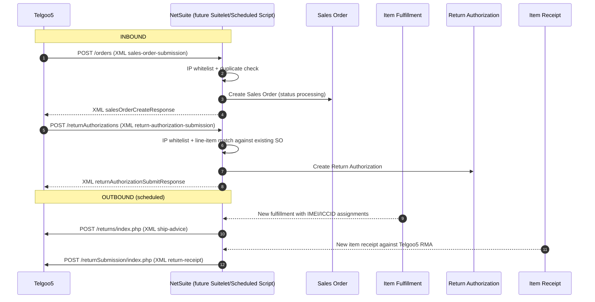

# Telgoo5 ↔ Interchange Processes (Reference for NetSuite Port)

This document describes every Telgoo5 integration flow currently running inside `interchange-api`. It is intended as a self-contained prompt for re-implementing the same behaviour as SuiteScripts inside the Q1W NetSuite account (the `q1w_customizations` SDF project), once the WooCommerce → Shopify migration retires Interchange.

The integration has **four flows**: two inbound (Telgoo5 → us) and two outbound (us → Telgoo5).

| # | Direction | Trigger | Transport | Endpoint (current) |
|---|-----------|---------|-----------|--------------------|
| 1 | Inbound  | New customer order placed in Telgoo5 | XML over HTTPS | `POST /api/xml/telgoo5/orders` |
| 2 | Inbound  | Customer-initiated RMA in Telgoo5    | XML over HTTPS | `POST /api/xml/telgoo5/returnAuthorizations` |
| 3 | Outbound | Order shipped (item fulfillment with serial assignments) | XML over HTTPS | `POST {store.apiUrl}/returns/index.php` |
| 4 | Outbound | RMA item received (item receipt) | XML over HTTPS | `POST {store.apiUrl}/returnSubmission/index.php` |

> Telgoo5's payload format is the legacy "BPXML" Brightpoint schema. The base XSDs (`BPXML-SalesOrder.xsd`, `BPXML-ShipAdvice.xsd`) are kept in `interchange-api/src/modules/layer02/dataSources/telgoo5/wsdl/` for reference if the port ever needs to be extended.

---

## 1. Overview



---

## 2. Per-Store Configuration ("Telgoo5 Store Meta")

Every Telgoo5 storefront we integrate with maps to one **store** record plus a **`telgoo5_store_meta`** record (one-to-one). All four flows above resolve their store via this meta.

| Field          | Type   | Used for                                   | Notes |
|----------------|--------|--------------------------------------------|-------|
| `partnerName`  | string | **Unique key** — inbound XMLs identify the store via `message-header/partner-name` | Unique constraint at the DB level. |
| `customerId`   | string | Echoed back to Telgoo5 in outbound XMLs (`<customer-id>`) | Issued by Telgoo5; identifies us to them. |
| `sourceUrl`    | string | Echoed back in outbound `<source-url>` and inbound responses | Per-store URL string Telgoo5 supplies. |
| `apiUrl`       | string | Base URL for all outbound calls            | Outbound posts go to `{apiUrl}/returns/index.php` and `{apiUrl}/returnSubmission/index.php`. |

In addition, the parent **store** record carries:

- `orderPrefix` (string) and a `storeSettings.useAndRemoveOrderPrefix` (boolean). When the toggle is on:
  - Inbound: stored order number is `${orderPrefix}_${customer-order-number}`.
  - Outbound: the prefix is stripped before sending so Telgoo5 sees the original number.
- `isActive` (boolean) — outbound flows only run for active stores.
- An IP whitelist (one or more rows in a child table — see §7).

### Sample storefronts (live as of writing)
The DataSource header documents Telgoo5's known root URLs:

```
https://asyncredo.telgoo5.com:8084/shipadvice/shipAdevice.php
https://asyncredo.telgoo5.com:8084/returns/index.php
https://asyncredo.telgoo5.com:8084/returnSubmission/index.php
https://asyncredo.telgoo5.com:8084/inventorySync/index.php
```

Note: the `/shipadvice/shipAdevice.php` path is **not** what we currently POST to — ship advice is sent to `/returns/index.php` (Telgoo5 routes both paths to the same handler). Inventory sync is not implemented today.

---

## 3. Inbound Flow: New Sales Order

### 3.1 Endpoint

```
POST /api/xml/telgoo5/orders
Content-Type: application/xml (parsed via body-parser text/xml)
```

### 3.2 Authentication

There is **no API key**. Authentication is by **source IP**:

1. Read `x-forwarded-for` and `x-real-ip` headers (CSV-split).
2. Fail with `401 COULD_NOT_DETERMINE_REQUEST_SOURCE` if neither header has a value.
3. Look up every IP in the `api_client_identifier_inclusion_list` table (column `identifier`, scoped by `store_id`).
4. Fail with `401 CLIENT_HOSTNAME_NOT_WHITELISTED` if no row matches.

The whitelist is **per-store** but not enforced during request handling — any whitelisted IP can submit for any store; the actual store is then selected by `partner-name` in the body. (For the NetSuite port it is fine to start with a single global whitelist record and make it per-store later.)

### 3.3 Request body — XML structure

```xml
<message>
  <message-header>
    <message-id>…</message-id>
    <create-timestamp>YYYYMMDDHHMMSS</create-timestamp>
    <partner-name>…</partner-name>          <!-- store lookup key -->
    <source-url>…</source-url>
    <transaction-name>sales-order-submission</transaction-name>
  </message-header>
  <sales-order-submission>
    <header>
      <customer-id>…</customer-id>
      <order-header>
        <customer-order-number>…</customer-order-number>   <!-- ≤25 chars -->
        <customer-order-date>YYYYMMDD</customer-order-date>
      </order-header>
      <shipment-information>
        <ship-first-name>…</ship-first-name>
        <ship-last-name>…</ship-last-name>
        <ship-address1>…</ship-address1>
        <ship-address2>… or empty</ship-address2>
        <ship-city>…</ship-city>
        <ship-state>…</ship-state>
        <ship-post-code>…</ship-post-code>
        <ship-country-code>…</ship-country-code>
        <ship-phone1>…</ship-phone1>
        <ship-email>…@…</ship-email>
        <ship-via>G2DAYP | UPSR | UPSS</ship-via>            <!-- enum, validated -->
      </shipment-information>
    </header>
    <detail>
      <line-item>
        <product-name>…</product-name>
        <line-reference>…</line-reference>
        <quantity>numeric string</quantity>
        <item-code>SKU or empty</item-code>
      </line-item>
      <!-- 1..N line-item nodes -->
    </detail>
  </sales-order-submission>
</message>
```

#### Field rules

| XML path | Type | Required | Notes |
|----------|------|:--------:|-------|
| `message-header/message-id` | string | yes | Echoed in response. |
| `message-header/create-timestamp` | string | yes | `YYYYMMDDHHMMSS`. |
| `message-header/partner-name` | string | yes | Used to find the store. |
| `message-header/source-url` | string | yes | Echoed in response. |
| `message-header/transaction-name` | string | yes | Always `sales-order-submission`. |
| `sales-order-submission/header/customer-id` | string | yes | Customer id at Telgoo5 (informational). |
| `…/order-header/customer-order-number` | string ≤25 | yes | **Idempotency key** for this store. |
| `…/order-header/customer-order-date` | string | yes | `YYYYMMDD`. |
| `…/shipment-information/ship-via` | enum | yes | One of `G2DAYP`, `UPSR`, `UPSS`. |
| `…/shipment-information/ship-address2` | string | yes (may be empty) | Other address fields are non-empty. |
| `…/shipment-information/ship-email` | email | yes | Validated. |
| `detail/line-item` | object **or** array | yes | **XML quirk:** when there is exactly one line item the parser returns an object, not an array. Always normalise to an array before iterating. |
| `line-item/product-name` | string | yes | Used as the product display name. |
| `line-item/quantity` | numeric string | yes | Coerced to `Number`. |
| `line-item/line-reference` | string | yes | Carried through to the order line. |
| `line-item/item-code` | string | yes (may be empty) | Treated as the SKU. |

### 3.4 Handler logic

1. Validate XML against the schema above; on failure return `400` with an error envelope (see §3.7).
2. Resolve store: `store = stores.findOne({ type: 'telgoo5', telgoo5PartnerName: partnerName })`. If missing → `404 Store with partner name <partnerName> not found.`
3. Idempotency check: `externalOrders.findOne({ storeId, externalId: customer-order-number })`. If present → `409 Order <orderNumber> has already been submitted.` (the existing record is left untouched).
4. Persist the **raw XML body** as an `external_order` row keyed by `(store_id, external_id)` with `note = 'fromTelgoo5'`.
5. Return the success XML envelope (see §3.6) with HTTP `200`.

### 3.5 Asynchronous processing (cache → real Sales Order)

A scheduled job (`processSalesOrderCache`, runs every few minutes) iterates every `telgoo5` store and processes its unprocessed `external_order` rows. Per row, in a single DB transaction:

1. **Customer**: upsert by email (`shipping-information/ship-email`). If existing customer is found by email, update first name / last name / phone; otherwise create.
2. **Address**: build a single address record from the `shipment-information` block; reused as both shipping and billing.
   - `addressee = "ship-first-name + ' ' + ship-last-name"`
   - `company = ''` (Telgoo5 doesn't supply one).
3. **Products**: for each unique SKU on the order, upsert by SKU (`bulkSaveProductsReturningAll`) using `product-name` as the display name. Weight is left blank.
4. **Sales Order**: create a new sales order:
   - `orderNumber` = `customer-order-number` (or `${orderPrefix}_${number}` if `useAndRemoveOrderPrefix` is on)
   - `orderDate` = "now" (the XML's `customer-order-date` is **not** used for the live flow — only the historical importer uses it)
   - `paymentMethodName = 'unknown'`, `rawPaymentMethod = 'notProvided'`
   - `requestedShippingService = ship-via` (the literal `G2DAYP`/`UPSR`/`UPSS` value)
   - `statusName = 'processing'`
   - Line items: `{ lineReference, quantity, productId, itemTotalCents=0, taxTotalCents=0, feeTotalCents=0, discountTotalCents=0, weight={unit:'grams',value:0} }`
5. Mark the `external_order` row as processed and link it to the new sales-order id.
6. Outside the transaction, fire an `salesOrder_created` email/app-event.

> **Pricing is intentionally zero.** Telgoo5 doesn't send line prices on the inbound submission, so the order has no monetary totals. Downstream systems treat these orders as "fulfillment-only" — they are exempt from automatic stale-order cancellation (see §7).

### 3.6 Success response (XML)

```xml
<?xml version="1.0" encoding="UTF-8"?>
<message>
  <message-header>
    <message-id>{{messageId}}</message-id>
    <transaction-name>sales-order-submission</transaction-name>
    <partner-name>{{partnerName}}</partner-name>
    <source-url>{{sourceUrl}}</source-url>
    <create-timestamp>{{timestamp}}</create-timestamp>
    <response-request>0</response-request>
  </message-header>
  <message-status>
    <status-code>0</status-code>
    <status-description>{{statusDescription}}</status-description>
    <comments>{{comments}}</comments>
    <response-timestamp>{{timestamp}}</response-timestamp>
    <filename>{{filename}}</filename>
  </message-status>
  <transactionInfo>
    <eventID>{{requestId}}</eventID>
  </transactionInfo>
</message>
```

Placeholders:

| Placeholder         | Value used today |
|---------------------|------------------|
| `{{messageId}}`     | echoed from `message-header/message-id` |
| `{{partnerName}}`   | echoed |
| `{{sourceUrl}}`     | echoed |
| `{{timestamp}}`     | server-side `DateTime.now()` formatted `yyyyMMddHHmmss` |
| `{{statusDescription}}` | `Message Successful` |
| `{{comments}}`      | `Message Successful` |
| `{{filename}}`      | `Interchange API` (rename when ported) |
| `{{requestId}}`     | the internal request id we logged this call against (UUID) |

### 3.7 Error envelope

Errors of all kinds (validation, not-found, collision, internal) return an XML envelope with the matching HTTP status (`400/401/404/500`):

```xml
<?xml version="1.0" encoding="UTF-8" standalone="yes" ?>
<message>
  <requestId>…</requestId>
  <error>
    <name>VALIDATION_ERROR | NotFoundError | CollisionError | INTERNAL_SERVER_ERROR | …</name>
    <description>human-readable message</description>
  </error>
</message>
```

---

## 4. Inbound Flow: RMA Submission

### 4.1 Endpoint

```
POST /api/xml/telgoo5/returnAuthorizations
```

Same auth model (IP whitelist) as §3.2.

### 4.2 Request body — XML structure

```xml
<message>
  <message-header>
    <message-id>…</message-id>
    <create-timestamp>…</create-timestamp>
    <partner-name>…</partner-name>
    <source-url>…</source-url>
    <transaction-name>return-authorization-submission</transaction-name>
  </message-header>
  <return-authorization-submission>
    <header>
      <customer-id>…</customer-id>
      <order-header>
        <customer-order-number>…</customer-order-number>   <!-- references an existing SO -->
        <customer-order-date>…</customer-order-date>
      </order-header>
      <shipment-information>
        <ship-first-name>…</ship-first-name>
        <ship-last-name>…</ship-last-name>
        <ship-address1>…</ship-address1>
        <ship-address2>… or empty</ship-address2>
        <ship-city>…</ship-city>
        <ship-state>…</ship-state>
        <ship-post-code>…</ship-post-code>
        <ship-country-code>…</ship-country-code>
        <ship-phone1>…</ship-phone1>
        <ship-email>…@…</ship-email>
      </shipment-information>
    </header>
    <detail>
      <line-item>
        <item-code>SKU or empty</item-code>
        <product-name>…</product-name>
        <quantity>numeric string</quantity>
        <esn>… or empty</esn>
        <imei>… or empty</imei>
        <iccid>… or empty</iccid>
      </line-item>
      <!-- 1..N — same single-vs-array quirk as orders -->
    </detail>
  </return-authorization-submission>
</message>
```

Notes:
- `shipment-information` here is the **return-from address** the customer is shipping back from. There is no `ship-via` element on RMAs.
- Each line item carries up to three serial-number flavours (`esn`, `imei`, `iccid`); exactly one will typically be populated.

### 4.3 Handler logic

1. Validate XML; resolve store by `partner-name` (404 if missing).
2. Look up the existing sales order by `customer-order-number` (raw `orderNumber` match — **no prefix munging** here, see §7). If missing → `404 Order <orderNumber> not found.`
3. Fetch the order's line items. For every submitted `<line-item>`, the SKU must exist on the order; otherwise → `404 Items in submission do not exist in this order, and cannot be returned.`
4. Build RMA line items by **consuming** order line items SKU-by-SKU (so two RMA lines on the same SKU pair against two distinct order lines). For each:
   - `lineItemId` = consumed order line's id
   - `quantity` = numeric value of `quantity`
   - `serialNumber` = first non-empty of `esn`, `imei`, `iccid`
   - `refundAmountCents = 0`
   - `reasonForReturn = ''`
5. Create the RMA via `returnAuthorization.initiate({ orderId, initialNote: '', lineItems })`.
6. Side effects (in parallel, **after** the RMA is committed):
   - Audit-log on the order: title `Return Request Initiated`, content "A return authorization was initiated for the order."
   - Audit-log on the RMA: title `Return Request Initiated`, content "The return authorization was initiated."
   - Email/app-event: `returnAuthorization_requested`.
7. Respond with the success XML below.

### 4.4 Success response (XML)

Identical envelope to §3.6 except `transaction-name = return-authorization-submission`. Placeholders: same.

---

## 5. Outbound Flow: Ship Advice

### 5.1 When to send

For each Telgoo5 **item fulfillment** (one per shipment) where:

- The store is `telgoo5` and `is_active = TRUE`.
- The fulfillment has at least one **inventory-number assignment** (i.e. the warehouse has scanned an IMEI/ICCID against a line). If no serial assignments exist, no ship advice is sent (the line items are device lines that need a serial). Today the SQL only emits one row per `(item_fulfillment, line_item)` that has at least one assignment, but multiple assignments per line are flattened by grouping on `lineItemOrderLine`.
- The order has a `sales.shipment` row (with `tracking_number`).
- The order date is within the **last 30 days** (older orders are skipped).
- We have **never** previously written an HTTP request for this fulfillment to the join table `item_fulfillment.item_fulfillment_x_fulfillment_notification_http_request` (the idempotency guard).

The `reportOrderCompletion` daemon runs every **300 seconds (5 minutes)** and processes all eligible fulfillments serially.

### 5.2 Endpoint

```
POST {store.apiUrl}/returns/index.php
Headers: (none beyond defaults — content type defaults to text/xml via util)
Timeout: 30000 ms
```

A **client-side request id** (UUID v4) is generated *before* the request is logged so the join row in the HTTP-request log table can reference it.

### 5.3 Body — XML structure

```xml
<?xml version="1.0" encoding="UTF-8" standalone="yes" ?>
<message>
  <message-header>
    <message-id>{{messageId}}</message-id>
    <transaction-name>ship-advice</transaction-name>
    <partner-name>{{partnerName}}</partner-name>
    <source-url>{{sourceUrl}}</source-url>
    <create-timestamp>{{createTimestamp}}</create-timestamp>
    <response-request>1</response-request>
  </message-header>
  <ship-advice>
    <header>
      <customer-id>{{customerId}}</customer-id>
      <shipment-information>
        <ship-first-name>{{customerFirstName}}</ship-first-name>
        <ship-last-name>{{customerLastName}}</ship-last-name>
        <ship-address1>{{shippingStreet1}}</ship-address1>
        <ship-city>{{shippingCity}}</ship-city>
        <ship-state>{{shippingUsState}}</ship-state>
        <ship-post-code>{{shippingPostalCode}}</ship-post-code>
        <ship-country-code>{{shippingCountryCode}}</ship-country-code>
        <ship-phone1>{{customerPhoneNumber}}</ship-phone1>
        <ship-email>{{customerEmail}}</ship-email>
        <ship-via>UPSB</ship-via>
        <ship-request-date>{{shippingDate}}</ship-request-date>
        <ship-request-warehouse />
      </shipment-information>
      <purchase-order-information>
        <purchase-order-number />
        <account-description />
        <purchase-order-amount>0.0</purchase-order-amount>
        <currency-code>USD</currency-code>
      </purchase-order-information>
      <order-header>
        <customer-order-number>{{orderNumber}}</customer-order-number>
        <customer-order-date>{{orderDate}}</customer-order-date>
        <order-sub-total>0.0</order-sub-total>
        <order-discount>0.0</order-discount>
        <order-tax1>0.0</order-tax1>
        <order-tax2>0.0</order-tax2>
        <order-tax3>0.0</order-tax3>
        <order-shipment-charge>0.0</order-shipment-charge>
        <order-total-net>0.0</order-total-net>
        <order-status>Completed</order-status>
        <order-type />
        <brightpoint-order-number />
        <warehouse-id />
        <ship-date>{{shippingDate}}</ship-date>
      </order-header>
    </header>
    <detail>
      {{lineItemsXml}}
    </detail>
  </ship-advice>
  <transactionInfo>
    <eventID>{{requestId}}</eventID>
  </transactionInfo>
</message>
```

Per-line fragment (one block per fulfillment line, repeated inside `<detail>`):

```xml
<line-item>
  <line-no>{{lineNumber}}</line-no>     <!-- 1-indexed -->
  <line-reference />
  <item-code>{{sku}}</item-code>
  <ship-quantity>{{quantity}}</ship-quantity>
  <unit-of-measure>EA</unit-of-measure>
  <serial-list>
    <serial-numbers>
      <esn>{{esn}}</esn>     <!-- = imei || iccid (legacy duplication, see note) -->
      <imei>{{imei}}</imei>
      <iccid>{{iccid}}</iccid>
    </serial-numbers>
  </serial-list>
  <line-status />
  <base-price>0.0</base-price>
  <bill-of-lading>{{trackingNumber}}</bill-of-lading>   <!-- = shipment.tracking_number, or 'N/A' if missing -->
  <pallet-id />
  <scac />
  <container-id />
</line-item>
```

#### Placeholder mapping

| Placeholder | Source |
|-------------|--------|
| `{{messageId}}` | The original inbound `message-header/message-id` from the cached `external_order.raw_data` for this sales order. |
| `{{partnerName}}` / `{{sourceUrl}}` / `{{customerId}}` | From the store's `telgoo5_store_meta`. |
| `{{createTimestamp}}` | `now` formatted `yyyyMMddHHmmss`. |
| `{{customerFirstName}}` / `{{customerLastName}}` / `{{customerPhoneNumber}}` / `{{customerEmail}}` | Order's customer record. |
| `{{shippingStreet1}}` / `{{shippingCity}}` / `{{shippingUsState}}` / `{{shippingPostalCode}}` / `{{shippingCountryCode}}` | Order's `shipping_address`. **Note:** street2 / addressee / company / phone-on-address are not sent. |
| `{{shippingDate}}` | `shipment.created_at` (yyyyMMdd), falls back to `now`. |
| `{{orderNumber}}` | Order's `orderNumber`, with the prefix stripped iff `useAndRemoveOrderPrefix` is on (`replace('${prefix}_', '')`). |
| `{{orderDate}}` | Order's `orderDate` formatted `yyyyMMdd`. |
| `{{lineNumber}}` | 1-indexed line counter within the fulfillment. |
| `{{sku}}` | Inventory item SKU. |
| `{{quantity}}` | Fulfillment line quantity. |
| `{{esn}}` | **Equal to `imei || iccid`.** This is a legacy quirk: Telgoo5 historically only read `<esn>`, so we duplicate the assigned serial there as well as in its proper field (TODO: clean up — see QIPC-13258). |
| `{{imei}}` | Assignment of type `imei` for this line, or empty string. |
| `{{iccid}}` | Assignment of type `iccid` for this line, or empty string. |
| `{{trackingNumber}}` | `shipment.tracking_number`, or literal `N/A` if shipment is missing. |
| `{{requestId}}` | UUID we generated and logged this outbound request under. |

### 5.4 Hard-coded values

These are constants in the template — keep them when porting (Telgoo5 expects them):

- `transaction-name = ship-advice`
- `response-request = 1` (we want a response back)
- `ship-via = UPSB` (yes, regardless of the carrier our shipment actually used — it tells Telgoo5 "Brightpoint did the shipping"; do **not** use the inbound order's `ship-via` value)
- `unit-of-measure = EA`
- `currency-code = USD`
- `purchase-order-amount = 0.0`, `order-sub-total = 0.0`, all tax/discount/shipping-charge = `0.0`, `order-total-net = 0.0`, `base-price = 0.0`
- `order-status = Completed`

### 5.5 Persistence

Every outbound POST is logged as one HTTP-request record (request body, response body, status, headers, durations). The link to the originating fulfillment is stored in:

```
table: item_fulfillment.item_fulfillment_x_fulfillment_notification_http_request
columns: item_fulfillment_id, http_request_id
```

The presence of any row in that table for a fulfillment is what stops the daemon from re-sending. There is **no retry-on-failure logic today** — if the POST returned a non-2xx, the row is still written and the fulfillment is considered "notified". Re-sending requires an operator to delete the join row.

---

## 6. Outbound Flow: Return Receipt

### 6.1 When to send

Run by the `shipments` daemon's `deliveryNotifications` step (which currently invokes DevEdge first, then Telgoo5). For each Telgoo5 RMA where:

- The store is `telgoo5`.
- The RMA has at least one **item receipt** (`sales.item_receipt`) — i.e. the warehouse has logged that the customer's returned device was received.
- The RMA has **never** had an HTTP request written to `sales.return_authorization_x_delivery_notification_http_request` (idempotency).

One POST per qualifying RMA. The body contains one `<line-item>` per item-receipt line; `quantity` is **always `1`** because item receipts are intentionally recorded one serial at a time.

### 6.2 Endpoint

```
POST {store.apiUrl}/returnSubmission/index.php
```

(Same data source object as ship advice; just a different path under the same `apiUrl`.)

### 6.3 Body — XML structure

```xml
<message>
  <message-header>
    <message-id>{{messageId}}</message-id>             <!-- freshly generated UUID v4 -->
    <transaction-name>return-receipt</transaction-name>
    <partner-name>{{partnerName}}</partner-name>
    <source-url>{{sourceUrl}}</source-url>
    <create-timestamp>{{createTimestamp}}</create-timestamp>
    <response-request>1</response-request>
  </message-header>
  <return-receipt>
    <header>
      <customer-id>{{customerId}}</customer-id>
      <shipment-information>
        <ship-first-name>{{customerFirstName}}</ship-first-name>
        <ship-last-name>{{customerLastName}}</ship-last-name>
        <ship-address1>{{shippingStreet1}}</ship-address1>
        <ship-city>{{shippingCity}}</ship-city>
        <ship-state>{{shippingUsState}}</ship-state>
        <ship-post-code>{{shippingPostalCode}}</ship-post-code>
        <ship-country-code>{{shippingCountryCode}}</ship-country-code>
        <ship-phone1>{{customerPhoneNumber}}</ship-phone1>
        <ship-email>{{customerEmail}}</ship-email>
        <ship-via>UPSB</ship-via>
        <ship-request-date>{{shippingDate}}</ship-request-date>
        <ship-request-warehouse />
      </shipment-information>
      <purchase-order-information>
        <purchase-order-number>{{orderNumber}}</purchase-order-number>
        <account-description />
        <purchase-order-amount>0.00</purchase-order-amount>
        <currency-code />
        <comments />
      </purchase-order-information>
      <order-header>
        <customer-order-number>{{orderNumber}}</customer-order-number>
        <brightpoint-order-number />
        <brightpoint-return-number />
        <order-type>Regular</order-type>
      </order-header>
    </header>
    {{lineItemsXml}}
  </return-receipt>
</message>
```

Per-line fragment (note the wrapping `<detail>` is **inside** the line fragment, one wrapper per receipt line — this is how the upstream xml currently composes it):

```xml
<detail>
  <line-item>
    <line-no>{{lineNumber}}</line-no>
    <item-code>{{sku}}</item-code>
    <quantity>{{quantity}}</quantity>          <!-- always 1 -->
    <unit-of-measure>EA</unit-of-measure>
    <serial-list>
      <serial-numbers>
        <esn>{{inventoryNumber}}</esn>          <!-- the returned serial, regardless of imei/iccid -->
      </serial-numbers>
    </serial-list>
    <line-status>Return</line-status>
    <receipt-date>{{receiptDate}}</receipt-date>   <!-- yyyyMMdd of item-receipt creation -->
  </line-item>
</detail>
```

#### Placeholder mapping

| Placeholder | Source |
|-------------|--------|
| `{{messageId}}` | A fresh UUID v4 (return receipts do not echo any prior id). |
| `{{partnerName}}` / `{{sourceUrl}}` / `{{customerId}}` | `telgoo5_store_meta`. |
| `{{createTimestamp}}` | `now` formatted `yyyyMMddHHmmss`. |
| `{{customerFirstName}}` … `{{customerEmail}}` | The original order's customer. |
| `{{shippingStreet1}}` … `{{shippingCountryCode}}` | The original order's shipping address (the "ship-from" perspective, since the customer is the one returning the goods). |
| `{{shippingDate}}` | `shipment.created_at` of the original out-bound shipment, fallback to the RMA's `returnDate`. Format: `yyyyMMddHHmmss` (note: **different** format from ship-advice). |
| `{{orderNumber}}` | Original order's `orderNumber` (no prefix munging here today). |
| `{{lineNumber}}` | 1-indexed within the receipt. |
| `{{sku}}` | Receipt line's product SKU. |
| `{{quantity}}` | Always `1`. |
| `{{inventoryNumber}}` | The serial number recorded on the item-receipt line. |
| `{{receiptDate}}` | `item_receipt.meta_created` formatted `yyyyMMdd`. |

### 6.4 Hard-coded values

- `transaction-name = return-receipt`
- `response-request = 1`
- `ship-via = UPSB`
- `unit-of-measure = EA`
- `purchase-order-amount = 0.00`
- `order-type = Regular`
- `line-status = Return`

### 6.5 Persistence

```
table: sales.return_authorization_x_delivery_notification_http_request
columns: return_authorization_id, http_request_id
```

Same idempotency rule as ship advice — any row here for an RMA stops re-send.

---

## 7. Operational Notes

### 7.1 IP whitelist mechanism (current)

- Single table `api_client_identifier_inclusion_list (id, identifier, store_id)`.
- `identifier` is either an IP address or a hostname (free-text string match against `x-forwarded-for` / `x-real-ip`).
- Whitelist is checked **before** XML parsing; failures emit a `platform_invalidOrderDataSubmitted` app-event.
- The check is IP-only — there is no shared secret, HMAC, or mTLS between Telgoo5 and us.
- For the NetSuite port, Telgoo5 will be calling a Suitelet URL which by default is **publicly reachable**. Plan a Custom Record holding the allow-list and replicate the same `x-forwarded-for` / `x-real-ip` parsing inside the Suitelet entry point. (Or move to a token-based handshake — Telgoo5 can be re-configured to send headers if asked.)

### 7.2 Idempotency join tables

| Flow | Join table | Parent column | Effect of presence |
|------|------------|---------------|--------------------|
| Inbound order | `data_cache.external_order` (unique on `store_id, external_id`) | `external_id` (= `customer-order-number`) | Duplicate submission returns `409`. |
| Outbound ship advice | `item_fulfillment.item_fulfillment_x_fulfillment_notification_http_request` | `item_fulfillment_id` | Daemon skips this fulfillment. |
| Outbound return receipt | `sales.return_authorization_x_delivery_notification_http_request` | `return_authorization_id` | Daemon skips this RMA. |

There is no equivalent "RMA submission already received" guard on the inbound RMA flow today — duplicate submissions create duplicate RMAs. The NetSuite port should add one (e.g. unique key on `(internal_order_id, telgoo5_message_id)` on the RMA custom record).

### 7.3 Daemon cadences

| Daemon | Repeat | Purpose |
|--------|--------|---------|
| `processSalesOrderCache` | (every few minutes — see scheduled-job table) | Walks every store's external-order cache and creates real Sales Orders. Telgoo5 is one branch. |
| `reportOrderCompletion` | every **300 s** | Sends Telgoo5 ship-advice POSTs (also handles other stores' equivalents). |
| `shipments` → `deliveryNotifications` | (sub-step of `shipments` daemon) | Sends Telgoo5 return-receipt POSTs. |

### 7.4 Request/response logging

Every inbound and outbound HTTP transaction goes through a "logged HTTP request" wrapper that persists, per request, to:

- `http_request` (status, durations, method, url, headers, internal request id) plus a sibling table for the bodies (`incoming_http_request_xml_body` for inbound; matching outbound table for outbound).
- The internal request id is what becomes `<transactionInfo><eventID>` on responses we send back to Telgoo5 (so they can correlate against our logs if needed).

### 7.5 Order-prefix handling

When a store has `storeSettings.useAndRemoveOrderPrefix = true`:

- **Inbound order create** stores the order number as `${orderPrefix}_${customer-order-number}`.
- **Outbound ship advice** strips that prefix back off so Telgoo5 only ever sees the original number.
- **Inbound RMA** does **not** munge the prefix — it expects the raw `customer-order-number`. The order lookup is `byOrderNumber(orderNumber)`, which means RMAs only work cleanly for stores that have the prefix toggle **off** (matching today's behaviour). Worth fixing in the NetSuite version if a prefixed store starts processing RMAs.
- **Outbound return receipt** also does not strip the prefix today.

### 7.6 Stale-order cancellation exemption

Interchange runs a periodic "stale order" cancellation job that auto-cancels orders 10–20 days old that haven't been written to E1 / haven't been fulfilled. **Telgoo5 stores are explicitly exempted** (alongside `tMobileDevEdge` and `customizableFormat`) because Telgoo5 doesn't send payment data — these orders are fulfillment-only and would otherwise be cancelled prematurely. Replicate this exemption in NetSuite (don't run any auto-cancellation against Telgoo5 orders).

### 7.7 Status transitions

- Inbound order → `processing` (initial).
- The order is expected to progress through fulfillment normally; the ship-advice send is the "completion" signal back to Telgoo5.
- RMAs go through the standard RMA lifecycle; the return-receipt send happens at the **item-receipt** step (i.e. once the item has been physically received and a receipt logged), not when the RMA is approved.

### 7.8 Email / app events fired

| Event | When |
|-------|------|
| `salesOrder_created` | After cache→Sales Order processing succeeds. |
| `returnAuthorization_requested` | After an inbound RMA submission creates an RMA. |
| `platform_invalidOrderDataSubmitted` | When an inbound XML POST returns a non-200 (validation/auth/etc.). |

---

## 8. NetSuite Mapping Cheat-sheet (Port Checklist)

| Concern | Interchange today | NetSuite SuiteScript port |
|---------|-------------------|---------------------------|
| Inbound order webhook | Express route + `genXMLHandler` | Suitelet (Available without login) reading `request.getBody()`, parsing with `N/xml`, returning `text/xml`. |
| Inbound RMA webhook | Same | Same — second Suitelet at a different URL. |
| Telgoo5 store meta | `ecommerce.telgoo5_store_meta` row | Custom Record `customrecord_q1w_telgoo5_store` with fields `partner_name (unique)`, `customer_id`, `source_url`, `api_url`, plus a sublist for whitelisted IPs. Tie it to a NetSuite Subsidiary / Class / Channel as needed. |
| IP whitelist | `api_client_identifier_inclusion_list` | Either child record on the Telgoo5 store, or a single global "Allowed IPs" custom record. Suitelet checks `request.headers['x-forwarded-for']` (NetSuite preserves it) before doing any work. |
| Inbound idempotency on order number | `data_cache.external_order` unique key | Saved Search on Sales Order `externalid` (set externalid = `customer-order-number` per store). Reject with `409`-equivalent if found. |
| External-order cache → Sales Order | Async daemon `processSalesOrderCache` | Either: (a) create the SO synchronously inside the Suitelet (simpler, fewer moving parts since no enrichment is needed), or (b) Map/Reduce that walks a "Pending Telgoo5 Order" custom record. **Recommend (a)** unless rate-limit headroom is a concern. |
| Customer upsert by email | `customer.save({ email, … })` | `record.create({ type: customer })` after `customer.searchByEmail`. |
| Product upsert by SKU | `bulkSaveProductsReturningAll` | Lookup via `search.lookupFields(itemBySKU)`. The Q1W catalog should already contain the SKUs — error out instead of creating items. |
| Sales Order create | `sales.order.save` | `record.create({ type: salesOrder, … })`. Status starts in NetSuite as "Pending Fulfillment". Set custom column `custcol_q1w_telgoo5_line_reference`. |
| RMA create | `returnAuthorization.initiate` | `record.create({ type: returnAuthorization, … })` linked via `createdfrom` to the source SO. |
| Inbound RMA serial validation | "all submitted SKUs exist on the order" | Same logic — load the SO line items first and reject the request if any submitted SKU is unknown. |
| Outbound ship advice trigger | `reportOrderCompletion` daemon every 5 min | Scheduled Script (5-min cadence) running a saved search of Item Fulfillments where `store=telgoo5`, has serial assignments, has tracking number, age ≤ 30 days, and not already linked to a "Telgoo5 Ship Advice" custom record. |
| Outbound return-receipt trigger | `shipments / deliveryNotifications` | Scheduled Script over Item Receipts on Telgoo5 RMAs not yet linked to a "Telgoo5 Return Receipt" custom record. |
| Outbound HTTP | `requestUtil.loggedXMLFetch` | `N/https` POST. Wrap in a helper that always writes a "Telgoo5 HTTP Log" custom record (request body, response body, status, durations) **and** the appropriate idempotency-link record. |
| Logging / audit | `http_request` + `incoming_http_request_xml_body` | Custom Record `customrecord_q1w_telgoo5_http_log` (long-text fields for body, plain fields for status/method/url/duration/internal id). |
| Order prefix toggle | `storeSettings.useAndRemoveOrderPrefix` + `orderPrefix` | Boolean + text field on the Telgoo5 Store custom record. Apply in the same two places (inbound write, outbound send). |
| Stale-order auto-cancel exemption | `enum_store_type_name IN ('telgoo5', …)` skip | Don't run any cancellation job against Telgoo5 orders. (If Q1W has a generic auto-cancel workflow, exclude this store/channel.) |
| `salesOrder_created` / `returnAuthorization_requested` emails | `emailUtil.sendEmail({ appEvent })` | Either NetSuite Workflow with email send action, or `N/email` from a User Event on the Sales Order / RMA. Subject lines & templates can be ported separately. |
| Fixed payload constants | hard-coded in xml templates | Keep verbatim — `ship-via=UPSB`, `currency=USD`, `unit-of-measure=EA`, `response-request=1`, `order-status=Completed`, `order-type=Regular`, `line-status=Return`, all monetary fields = `0`/`0.0`/`0.00`. |

### 8.1 Suggested SuiteScript layout

Following the existing `q1w_customizations` conventions:

```
SuiteScripts/quality_one_wireless/
  constants/
    q1w_telgoo5_constants.js              // endpoints, hard-coded XML constants, transaction names
  modules/
    helper/
      q1w_telgoo5_xml_helper.js           // build & parse XML (template-string based, no DOM lib needed)
      q1w_telgoo5_http_helper.js          // wraps N/https, writes the HTTP log record
      q1w_telgoo5_whitelist_helper.js     // IP whitelist check
    managers/
      q1w_telgoo5_order_manager.js        // inbound order: validate -> upsert customer -> create SO
      q1w_telgoo5_rma_manager.js          // inbound RMA: validate against SO -> create RMA
      q1w_telgoo5_shipadvice_manager.js   // outbound ship advice builder + sender
      q1w_telgoo5_returnreceipt_manager.js // outbound return receipt builder + sender
  suitelet/
    q1w_telgoo5_order_sl.js               // POST /orders endpoint
    q1w_telgoo5_rma_sl.js                 // POST /returnAuthorizations endpoint
  scheduledscript/
    q1w_telgoo5_shipadvice_ss.js          // 5-min cadence
    q1w_telgoo5_returnreceipt_ss.js       // 5-15-min cadence
```

Custom records to add via SDF:

- `customrecord_q1w_telgoo5_store` (one per partner)
- `customrecord_q1w_telgoo5_allowed_ip` (child of store)
- `customrecord_q1w_telgoo5_http_log` (one per inbound/outbound call)
- `customrecord_q1w_telgoo5_shipadvice_link` (FK to Item Fulfillment + HTTP log)
- `customrecord_q1w_telgoo5_returnreceipt_link` (FK to Item Receipt + HTTP log)
- Optional: `customrecord_q1w_telgoo5_pending_order` if going async on inbound order processing.

---

## Appendix A — Source map (for dropping back into Interchange when porting)

| Concern | Path |
|---------|------|
| Inbound order Suitelet equivalent | `interchange-api/src/modules/layer09/xmlApi/telgoo5/order/submit.ts` |
| Inbound RMA Suitelet equivalent | `interchange-api/src/modules/layer09/xmlApi/telgoo5/returnAuthorization/submit.ts` |
| XML response templates | `interchange-api/src/modules/layer09/xmlApi/telgoo5/*/…Response.xml` |
| Inbound validators | `interchange-api/src/modules/layer01/validators/salesOrder/telgoo5.ts` |
| Cache → Sales Order processing | `interchange-api/src/modules/layer05/dataProcessing/telgoo5/process.ts` |
| Outbound ship-advice builder | `interchange-api/src/modules/layer02/dataSources/telgoo5/shipAdvice.ts` (+ `xml/shipAdvice*.xml`) |
| Outbound return-receipt builder | `interchange-api/src/modules/layer02/dataSources/telgoo5/returnReceipt.ts` (+ `xml/returnReceipt*.xml`) |
| Ship-advice scheduling/data fetch | `interchange-api/src/modules/layer06/daemons/reportOrderCompletion/telgoo5/index.ts` |
| Return-receipt scheduling | `interchange-api/src/modules/layer06/daemons/shipments/deliveryNotifications/telgoo5.ts` |
| Daemon registration | `interchange-api/src/modules/layer06/daemons/processSalesOrderCache.ts`, `…/reportOrderCompletion/index.ts`, `…/shipments/deliveryNotifications/index.ts` |
| Stale-order cancellation exemption | `interchange-api/src/modules/layer06/daemons/salesOrderCancellation/staleOrders.ts` |
| Telgoo5 store meta migrations | `interchange-api/migrations/20230511125918_telgoo5-store-meta.ts`, `…/20230612145144_telgoo5-add-source-url.ts`, `…/20230731173147_telgoo5-api-urls.ts` |
| IP-whitelist enforcement | `interchange-api/src/modules/layer06/apiUtil/shared.ts` (`guardRequestOriginatesFromWhitelistedSource`) |
| Reference XSDs (Brightpoint) | `interchange-api/src/modules/layer02/dataSources/telgoo5/wsdl/BPXML-SalesOrder.xsd`, `…/BPXML-ShipAdvice.xsd` |
| Historical-import script (one-shot) | `interchange-api/scripts/telgoo5HistoricalOrders/import.ts` |
